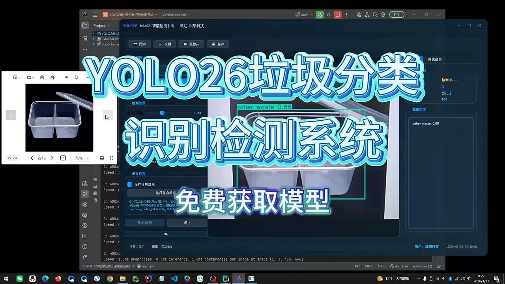
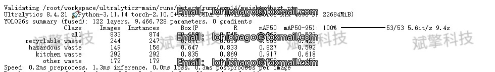
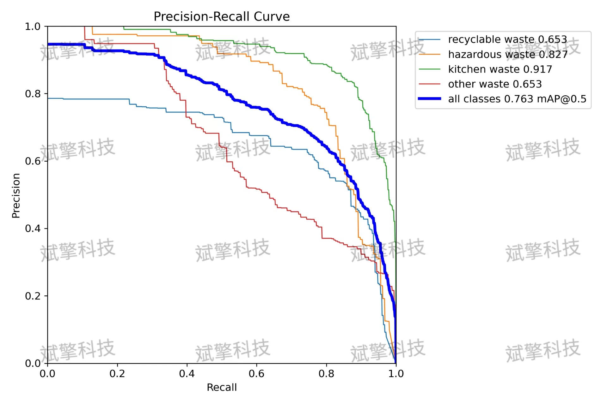
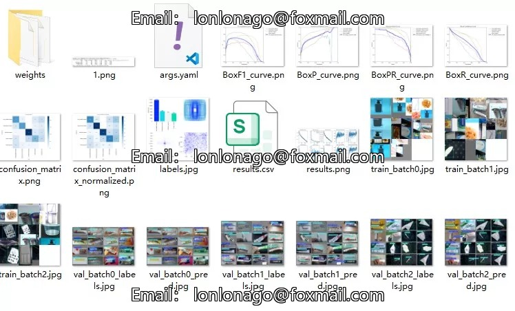
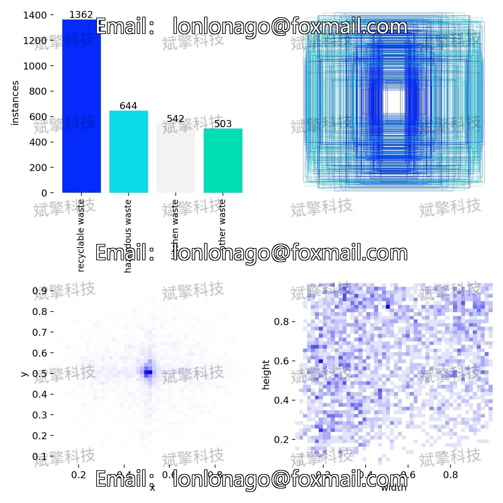
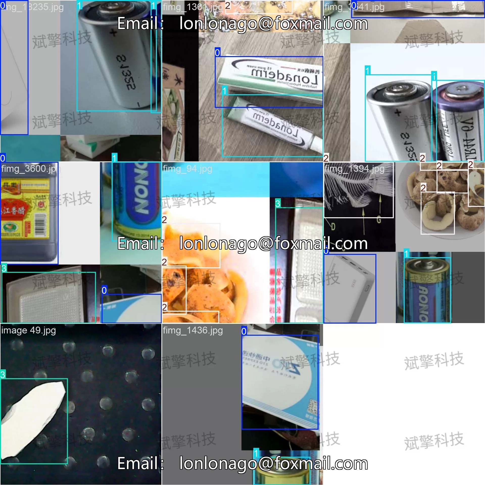
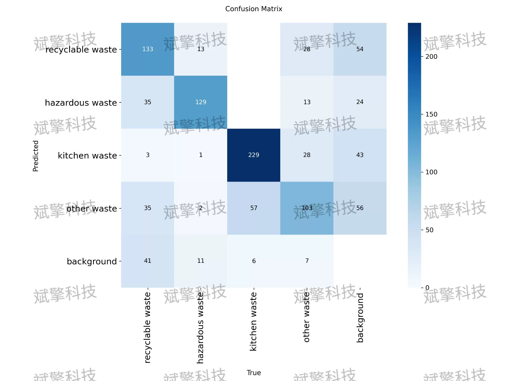
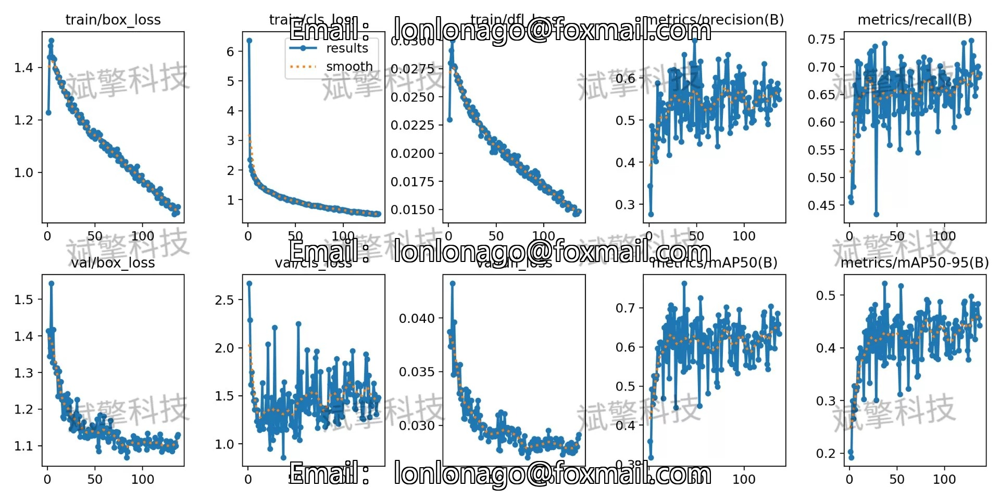
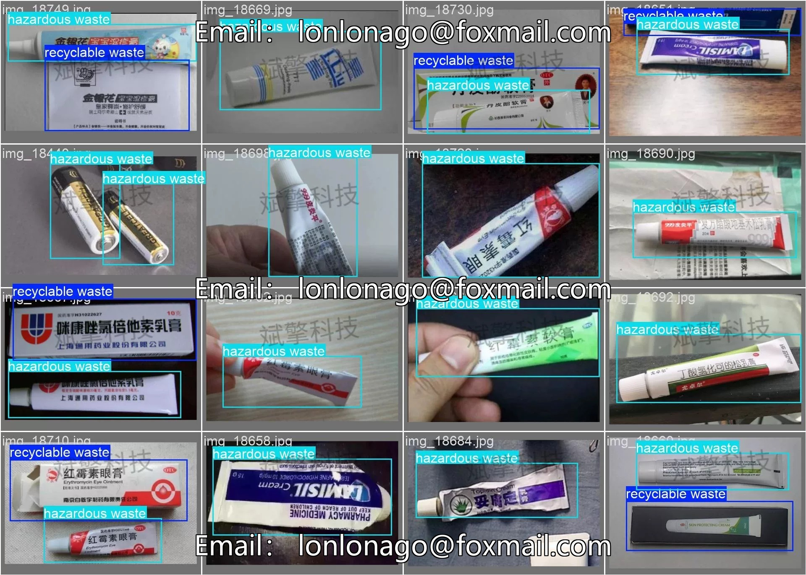

# YOLOv26 Classification System for Waste Sorting | Source Code + Model

## Body

YOLO26 Classification Detection System | Source Code + Model YOLO26 Real-World Application for Four-Class Waste Sorting Detection System (Project Source Code + Dataset + Model Weights + UI Interface + Python + Deep Learning + Remote Deployment)

With the acceleration of urbanization and the increasing environmental protection requirements, intelligent waste sorting has become a key technology for realizing resource recycling and reducing environmental pollution. This paper constructs a four-class waste sorting detection system based on the YOLO object detection algorithm, including recyclable waste (recyclable waste), hazardous waste (hazardous waste), kitchen waste (kitchen waste), and other waste (other waste). The experiment uses the YOLO26 model to train on a self-built dataset, which consists of 2743 images, with 1910 images in the training set and 833 in the validation set.

The dataset used in this study is a self-built garbage image dataset, covering the common four types of waste in daily life: recyclable waste (recyclable waste), hazardous waste (hazardous waste), kitchen waste (kitchen waste), and other waste (other waste). The dataset contains 2743 labeled images, divided into a training set and a validation set at a ratio of 7:3, with 1910 images in the training set and 833 in the validation set.

Free reservation for remote installation. Unsuccessful full refund.
Purchase Enjoy the following resources (Baidu Drive automatically unlocked)
    Full source code of YOLO recognition project
    YOLO format dataset
    Training code + UI interface code
    Trained model + results image
    Software install package
    Add WeChat to make a reservation for remote installation (Automatically display WeChat ID after purchase) - Unsuccessful, full refund

⚙️ Core Functional Modules
Detection Capability
    Image Detection: Upon upload, return detection boxes + category information
    Video Detection: Support video files, analyze frames accurately one by one
    Camera Real-Time Detection: Integrate USB camera, achieve dynamic monitoring
Interaction and Control
    Target Filtering: Choose one or more categories for detection freely
    Parameter Real-Time Adjustment: Adjustable confidence threshold & IoU threshold, flexibly control accuracy
    Result Save: One-click save images/video/camera detection results
System and Data
    User login registration: Support password strength detection + encrypted storage
    Log recording: Automate operation and error information (with timestamp)

## Images

## Payment

Here is a pay link on Stripe ( https://buy.stripe.com/3cs8yP7sY87d0vu9AB ). Please contact me lonlonago@foxmail.com after funding $89, and I will send you a complete data files , thank you!

